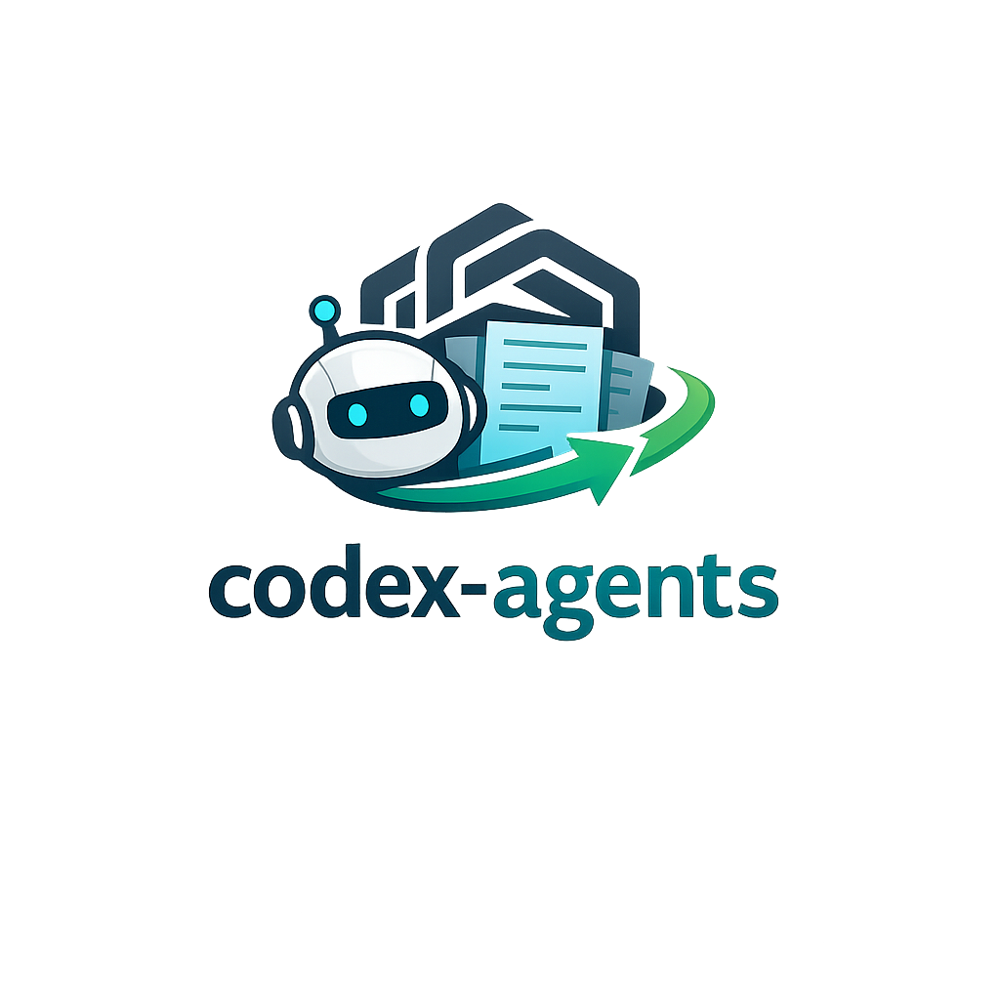
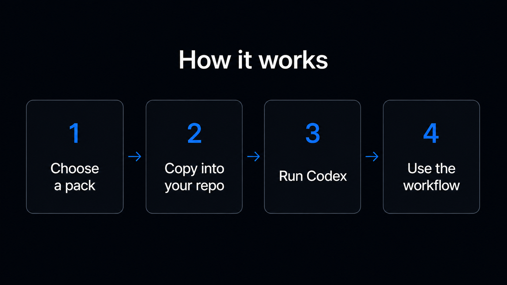

<h2 align="center">
  
  <br>
  <p align="center" style="margin-top: -140px;"><strong>Reusable <code>AGENTS.md</code> workflow packages for Codex.</strong></p>
</h2>

<p align="center">
  <a href="https://github.com/simonesiega/codex-agents/stargazers"></a>
  <a href="https://github.com/simonesiega/codex-agents/issues"></a>
  <a href="https://github.com/simonesiega/codex-agents/pulls"></a>
  <a href="https://github.com/simonesiega/codex-agents/commits/main"></a>
  <a href="LICENSE"></a>
</p>

<p align="center">
  <a href="agents/codebase-review-commit/README.md">Workflow packages</a> ·
  <a href="agents/codebase-review-commit/docs/usage.md">Usage guide</a> ·
  <a href="docs/agent-workflow-packages.md">Authoring docs</a>
</p>

<p align="center">
  
</p>


## Overview

`codex-agents` is a collection of copy-ready `AGENTS.md` workflow packages for Codex.

The idea is simple: instead of putting every instruction into one large always-loaded file, each package gives Codex a small router and a set of focused task files. Codex starts from `AGENTS.md`, understands the requested workflow, and follows only the instructions needed for that task. This makes the setup easier to reuse, easier to maintain, and more predictable across real repositories.

## Why use this repo

Most Codex setups start with one simple `AGENTS.md` file. Over time, that file often grows into a long mix of review rules, commit rules, audit instructions, documentation preferences, safety constraints, project conventions, and one-off notes. The result is harder to control: Codex receives more context than it needs, workflows become less precise, and small changes can affect unrelated tasks.

`codex-agents` gives you a cleaner starting point. <br>
It helps you use Codex with:

- <strong>fewer tokens</strong> spent on unrelated instructions
- <strong>faster setup</strong> through ready-to-copy workflow packages
- clearer separation between review, audit, and commit behavior
- <strong>more predictable outputs</strong> for each engineering task
- reusable templates that can be copied across repositories
- safer defaults for validation, Git operations, and task boundaries
- easier maintenance because each workflow lives in its own focused file

## Available packages

| Package | Use it when you need | Templates | Start here |
|---|---|---|---|
| [`codebase-review-commit`](agents/codebase-review-commit/) | Code review, deep audits, commit messages, and commit splitting | `full`, `review`, `commit` | [`README`](agents/codebase-review-commit/README.md) · [`Usage`](agents/codebase-review-commit/docs/usage.md) |

## Quick start

Copy one template pack into your target repository:

```bash
cp agents/<package-name>/templates/<template-name>/* /path/to/project/
```

Then open Codex inside your target repository and ask for the workflow you need.
Each package defines its own commands, templates, and workflow files. See the package README and usage guide for the available options.

For Windows PowerShell and package-specific commands, see the `<package-name>` usage guide.

## Usage example

To use the `codebase-review-commit` package, copy the full template into your project:

```bash
cp agents/codebase-review-commit/templates/full/* /path/to/project/
```

Then ask Codex to review the changed code, suggest a commit message, split the changes into commits, and do a deep audit before committing:

```txt
review --changed
suggest commit
split these changes into commits
deep audit before commit
```

Codex will start from the copied `AGENTS.md` router and load the focused workflow files only when they are relevant.

For Windows PowerShell and package-specific commands, see the [codebase-review-commit usage guide](agents/codebase-review-commit/docs/usage.md).

## Repository structure

The repository is organized around reusable workflow packages and shared documentation.

```txt
.
├── agents/   # workflow packages
├── assets/   # README images
└── docs/     # shared package-authoring documentation
```

## Package structure

Each package is self-contained and follows the same general structure:

```txt
package-name/
├── README.md             # package overview
├── docs/                 # package-specific usage docs
├── examples/             # example prompts and expected behavior
└── templates/            # copy-ready instruction packs
```

Templates contain the actual files that can be copied into a target repository.
A template can include one or more focused instruction files:

```txt
AGENTS.md       # small router and package entry point
REVIEW.md       # standard review behavior
REVIEW_DEEP.md  # deeper audit behavior
COMMIT.md       # commit message and commit-splitting behavior
```

This structure keeps each workflow package easy to copy, easy to understand, and easy to maintain over time.

## Shared documentation

The `docs` directory contains repository-wide guidance for creating, maintaining, and extending workflow packages.

| Document | Purpose |
|---|---|
| [`agent-workflow-packages`](docs/agent-workflow-packages.md) | Defines the standard structure and boundaries for workflow packages |
| [`authoring-guidelines`](docs/authoring-guidelines.md) | Explains how to write focused Codex instruction files |
| [`template-maintenance`](docs/template-maintenance.md) | Explains how to keep canonical files and copy-ready templates aligned |
| [`safety-principles`](docs/safety-principles.md) | Defines the safety baseline used across all packages |
| [`examples-guidelines`](docs/examples-guidelines.md) | Explains how to write realistic and useful package examples |

## License

This project is licensed under the MIT License. See [`LICENSE`](LICENSE).
